# Comparing Treatment With Multiple Outcomes Repository

## Overview

This repository contains a series of R scripts developed to illustrate various aspects of hypothesis testing, particularly focusing on Type I and Type II errors, their trade-offs, and visualizations related to bivariate distributions and hypothesis testing under different conditions. These scripts are ideal for educational purposes, providing clear visual examples of statistical concepts.

## Scripts Description

The repository includes the following R scripts:

1. **Bivariate Hypothesis Regions with Maximized Type I Error**
   - Demonstrates how to configure hypothesis testing regions to maximize the Type I error in a bivariate setting.
  
     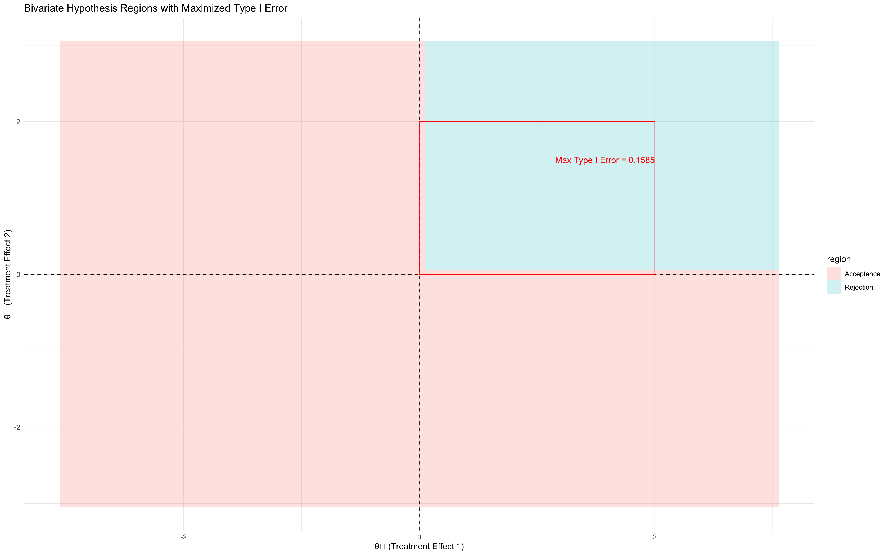

2. **Bivariate Normal Distribution with Type I Error Region**
   - Visualizes a bivariate normal distribution with regions that illustrate the Type I error.

     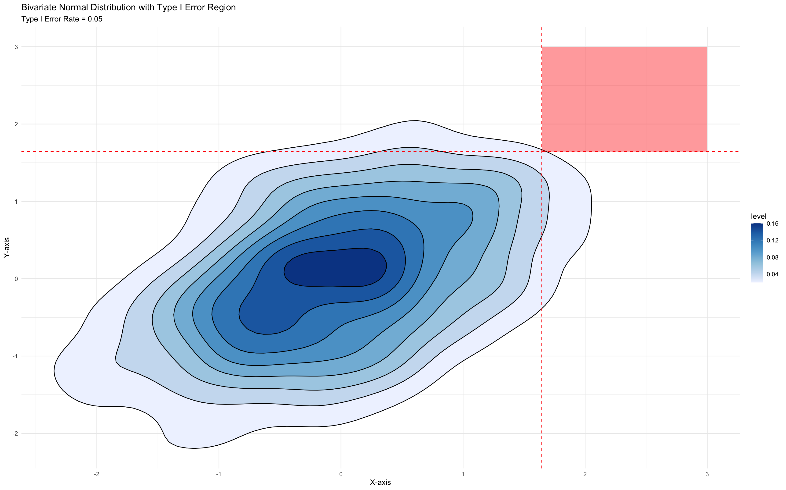

3. **High Correlation: Null (blue) vs. Alternative (red)**
   - Plots distributions under the null and alternative hypotheses, emphasizing scenarios with high correlation.
  
     _vs_Alternative_(red).png)

4. **Hypothesis Regions for Bivariate Test - Maximizing Type II Error**
   - Focuses on the configuration of hypothesis regions to maximize the Type II error in bivariate tests.
  
     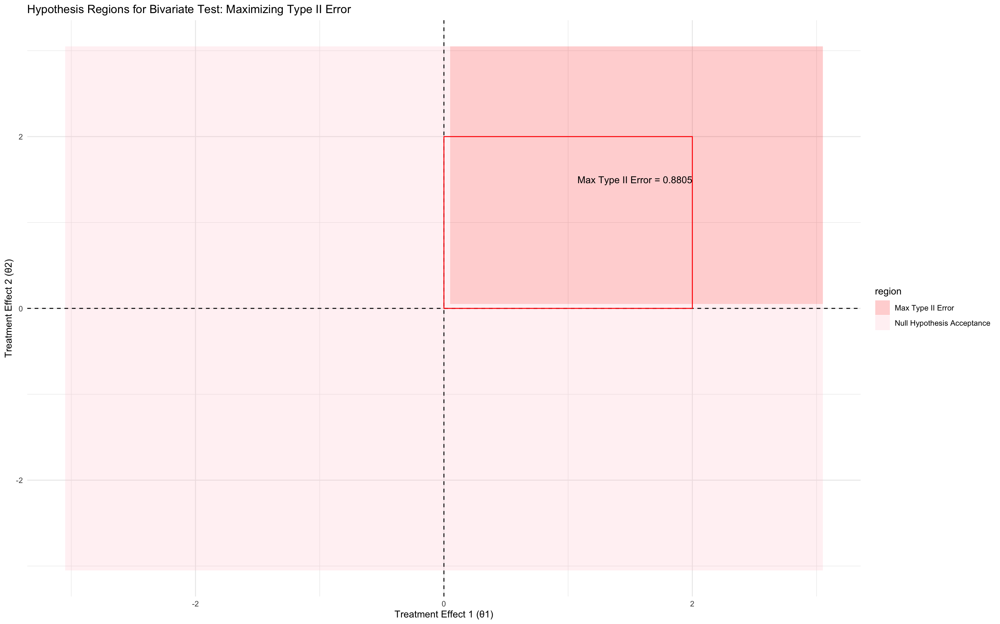

5. **Hypothesis Regions: Type I and Type II Errors**
   - Discusses the trade-offs between Type I and Type II errors in hypothesis testing.
  
     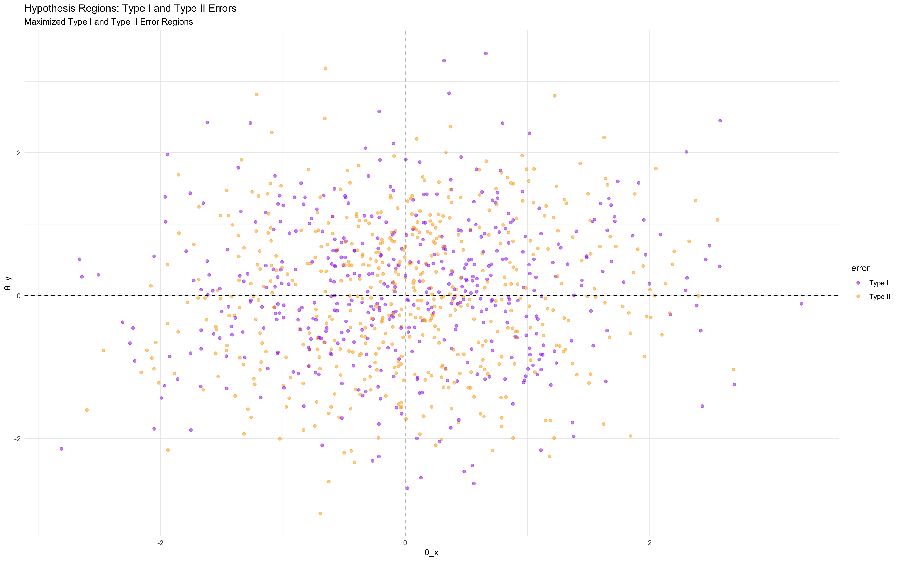

6. **Hypothesis Testing Regions**
   - Provides a general overview and visualization of hypothesis testing regions.
  
     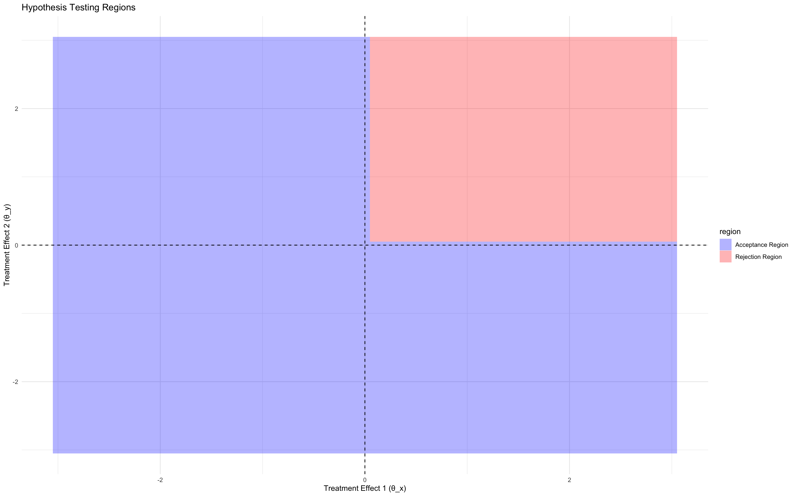

7. **Low Correlation: Null (blue) vs. Alternative (red)**
   - Similar to the high correlation script but with low correlation scenarios.
  
     _vs_Alternative_(red).png)

8. **Null (Blue) vs. Alternative (Red) Hypothesis Distributions**
   - Compares the distributions under null and alternative hypotheses with clear color-coded visualizations.
  
     _vs_Alternative_(Red)_Hypothesis_Distributions.png)

9. **Null vs. Alternative Hypothesis Distributions for a Right-Tailed Test**
   - Special focus on right-tailed tests comparing null and alternative hypothesis distributions.
  
     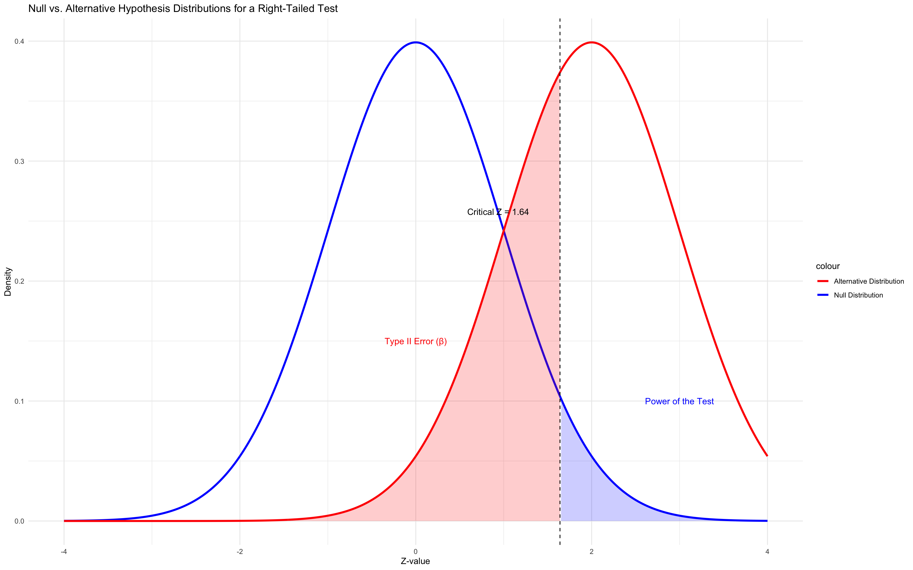

10. **Right-Tailed Hypothesis Test Visualization for Z-Score**
    - Visualizes right-tailed hypothesis tests using Z-scores.
   
      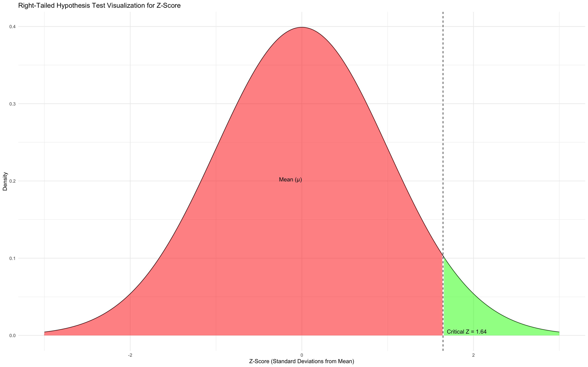

11. **Trade-offs: Type I Error = 0.09 | Type II Error = 0.8895**
    - Analyzes the trade-offs between Type I and Type II errors with specific error rates.
   
      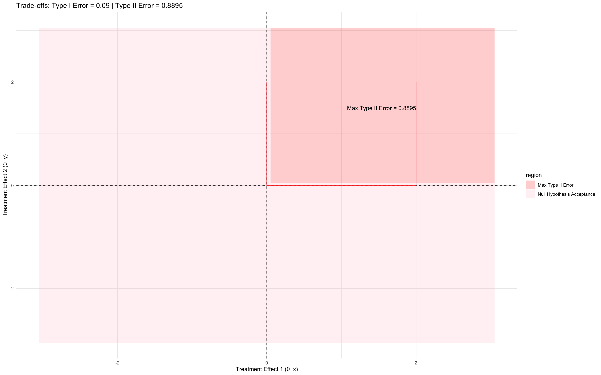

12. **Two Primary Endpoints with Co-Primary Outcome**
    - Explores hypothesis testing with two primary endpoints and a co-primary outcome scenario.
   
      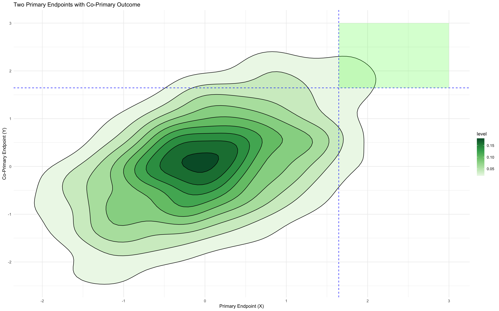

13. **Type II Error Rate vs. Sample Size in Bivariate Testing**
    - Examines how the Type II error rate changes with sample size in bivariate tests.
   
      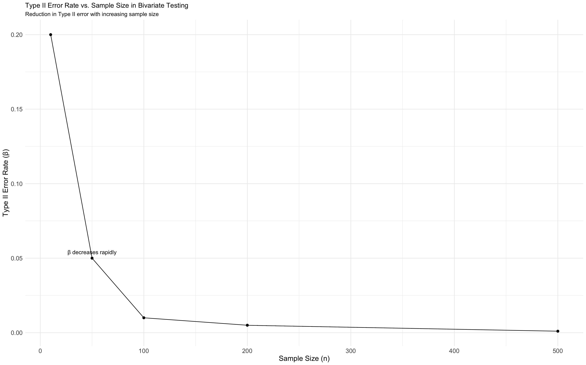

14. **Type II Error Rate vs. Sample Size**
    - A more general examination of the relationship between Type II error rates and sample size.
   
      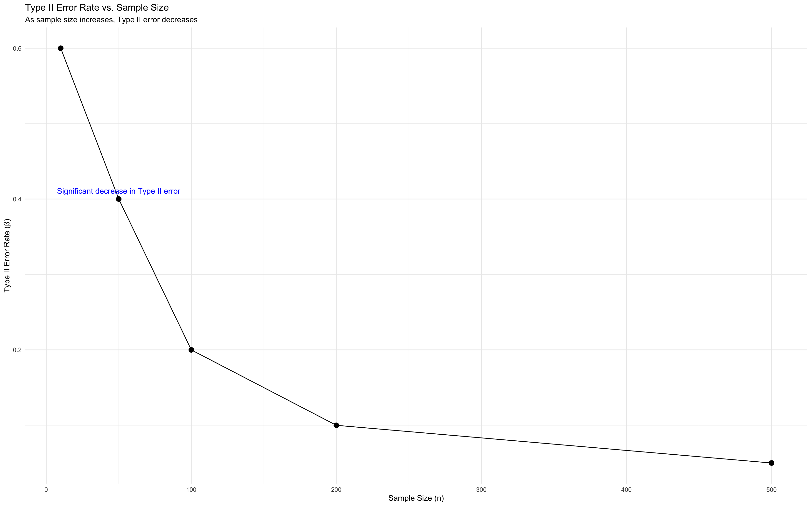

## Installation

To run these scripts, you will need R installed on your computer. You can download and install R from [The Comprehensive R Archive Network (CRAN)](https://cran.r-project.org/mirrors.html).

## Usage

To execute any script, load it into your R environment and run:

```r
source("path_to_script.R")
```

Replace `path_to_script.R` with the path to the script you want to run.

## Contributing

Contributions to this repository are welcome. Please fork the repository and submit a pull request with your additions or changes.

## License

This project is licensed under the MIT License - see the LICENSE.md file for details.

```r
This is the README formatted according to GitHub markdown syntax. Feel free to further adjust any sections to fit the specific details of your repository.
```
