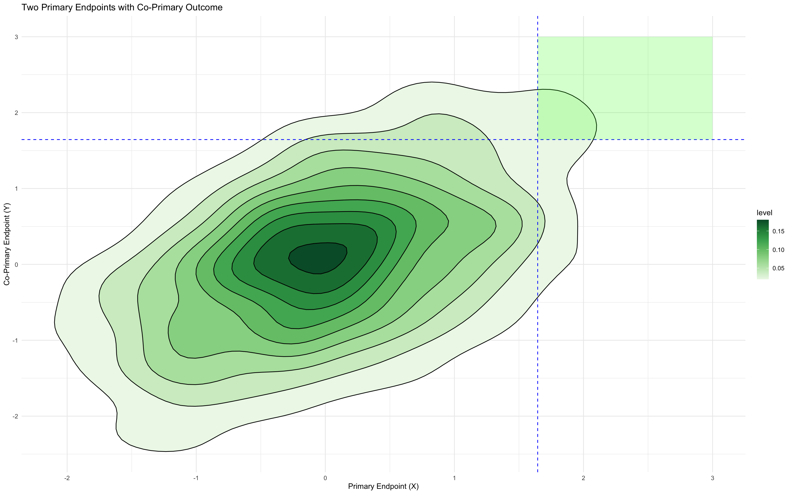
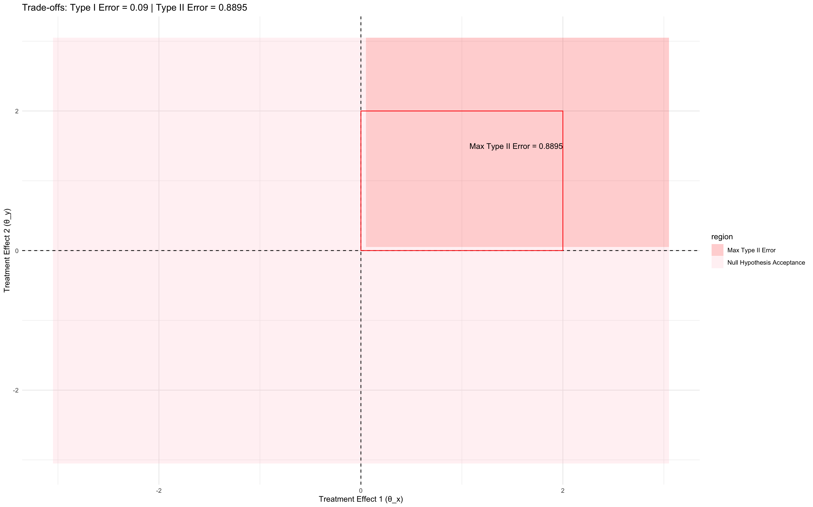
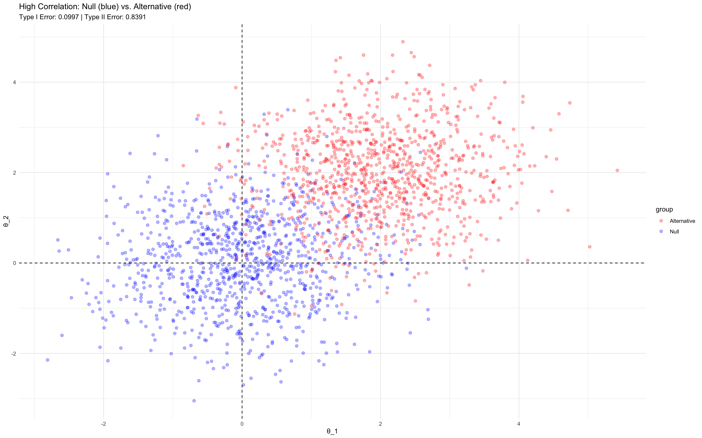
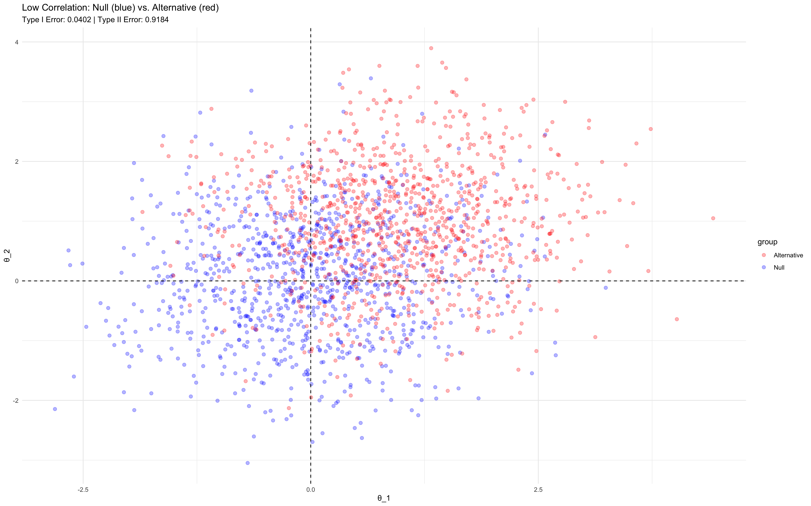
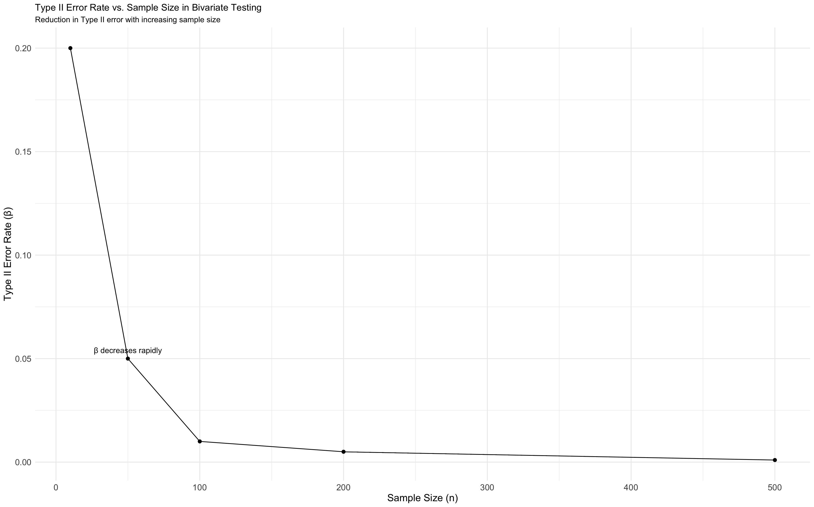

# Comparing Treatment With Multiple Outcomes

### Hypothesis testing, error trade-offs, and statistical power when a treatment is judged on several correlated outcomes

Simulation and visualisation code in R, from my **MSc Data Science and Analytics dissertation (University of Leeds)**.

## The problem

Evaluating a treatment on a **single** outcome is textbook hypothesis testing. But real treatments are usually judged on **several outcomes at once**: a drug that has to improve *two* co-primary endpoints, or an intervention measured across multiple correlated symptoms. Testing multiple outcomes changes the statistics in ways a single-outcome test hides:

- the **rejection region becomes joint** (for co-primary endpoints, a treatment must clear the threshold on *both* outcomes), which lowers power;
- the **correlation between outcomes** shifts both the false-positive rate and the power, so two studies with the same marginal effects can reach opposite conclusions;
- controlling the overall **Type I error** across outcomes trades off directly against **Type II error** and the **sample size** needed to detect a real effect.

This project builds the intuition for those effects through a series of `ggplot2` simulations, using the **bivariate normal** as the working model for two correlated outcomes.

## What's inside

Each script in [`code/`](code/) is standalone and reproducible; figures are in [`image/`](image/).

**1. Single-test foundations**
`right_tailed_hypothesis_test_visualization_for_z_score.R` ·
`null_vs_alternative_hypothesis_distributions_for_a_right_tailed_test.R` ·
`hypothesis_testing_regions.R` ·
`hypothesis_regions_type_i_and_type_ii_errors.R`

**2. The Type I / Type II error trade-off**
`trade_offs_type_i_error_0_09_type_ii_error_0_8895.R` shows a worked point: pushing the false-positive rate down to α = 0.09 drives the false-negative rate up to β = 0.89. You cannot minimise both at a fixed sample size.

**3. Two correlated outcomes (bivariate)**
`bivariate_normal_distribution_with_type_i_error_region.R` ·
`bivariate_hypothesis_regions_with_maximized_type_i_error.R` ·
`hypothesis_regions_for_bivariate_test_maximizing_type_ii_error.R`

**4. How correlation changes the picture**
`high_correlation_null_blue_vs_alternative_red.R` vs `low_correlation_null_blue_vs_alternative_red.R`: the same marginal effects, different outcome correlation, different overlap between the null and alternative.

**5. Co-primary endpoints**
`two_primary_endpoints_with_co_primary_outcome.R`: the joint rejection region (top-right) when success requires clearing the threshold on both a primary and a co-primary endpoint.

**6. Power and sample size**
`type_ii_error_rate_vs_sample_size.R` and `type_ii_error_rate_vs_sample_size_in_bivariate_testing.R`: how the false-negative rate falls as the sample grows, univariate and in the two-outcome setting.

## Selected figures

**Co-primary endpoints, joint rejection region**



**The Type I / Type II error trade-off**



**Outcome correlation changes null/alternative overlap**




**Power grows with sample size (two-outcome setting)**



## Reproduce

```r
install.packages(c("MASS", "dplyr", "ggplot2"))

# Each script in code/ is self-contained; run any one to produce its figure.
source("code/two_primary_endpoints_with_co_primary_outcome.R")
```

R >= 4.0. Simulations draw correlated outcomes with `MASS::mvrnorm` under a fixed `set.seed`, so every figure is reproducible.

## Scope

These are the illustrative simulations and figures from the dissertation: the aim is to make the multiple-outcome error and power trade-offs visible and statistically correct, not to report a specific trial's results. Built with `MASS` (bivariate-normal simulation), `dplyr`, and `ggplot2`.

## License

Released under the [MIT License](LICENSE).
